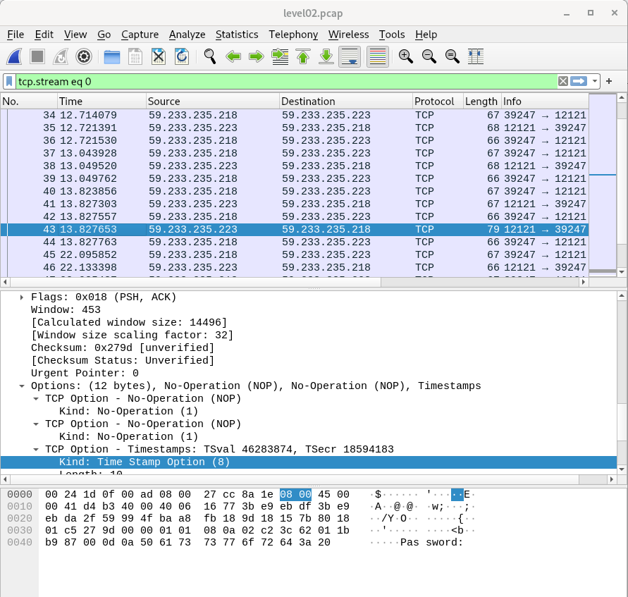

# Packets captured over clear text protocol -


chmod 777 .

### Copy to the host 

$ scp -P 4242 level02@127.0.0.1:/home/user/level02/level02.pcap .

Inspect with wireshark

open the file level02.pcap in wireshark




Knowing that, we will follow the TCP stream.

```
Analyze > Follow > TCP stream
```

ft_wandr...NDRel.L0L -> ft_waNDReL0L